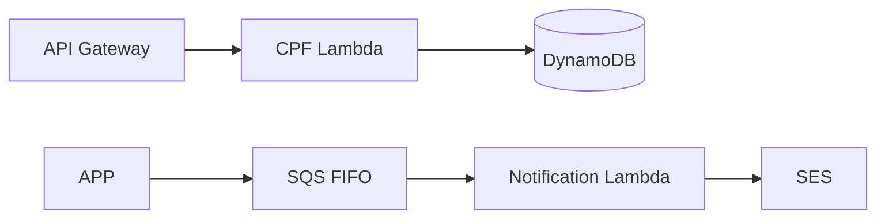

# Oficina Functions

This repository implements CPF challenge, token verification and notification handlers. K8S owns deployed Lambda resources; this repository has no local HTTP API or Dockerfile. The HTTP consumer contract is the APP [credential-free API snapshot](../Tech-challenge-15SOAT/docs/phase-3/api/contracts.md).

## Technologies and architecture

Java 17, Maven, Lambda Java handlers, DynamoDB, SQS FIFO and SES adapters. See [architecture](docs/architecture.md). From the root run `./mvnw.cmd -B verify` and `terraform -chdir=infra/modules/functions test`. CI is [`.github/workflows/ci.yml`](.github/workflows/ci.yml), triggered by push and pull request for `main`, `master`, and `develop`, plus manual dispatch.

Prerequisites: Java 17, the Maven wrapper, Terraform 1.15.8, and reviewed K8S environment inputs for handoff.

Deployment needs the reviewed [K8S handoff](../oficina-k8s-infra/docs/architecture.md), protected identity and authorized R4 window. No endpoint is claimed active.
