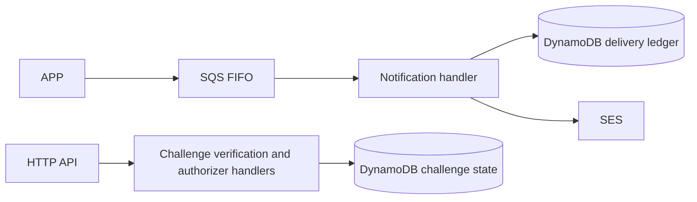

# Oficina Functions

Start with [architecture and sequences](docs/architecture.md), [requirement/evidence matrix](docs/evidence/requirements.md), and [APP API snapshots](../Tech-challenge-15SOAT/docs/phase-3/api/contracts.md).

Technologies: Java 17, Maven, AWS SDK v2, Lambda, SQS, DynamoDB, SES and Terraform 1.15.8. Prerequisites: JDK 17, Docker for integration tests, PowerShell 7 and Terraform. There is no local HTTP server or Dockerfile; public routes use the APP contract and Lambda handler adapters.

Run `./mvnw.cmd -B verify` (Linux: `./mvnw -B verify`) and `pwsh -File tests/verify-infrastructure.ps1`. [CI](.github/workflows/ci.yml) runs on PRs/pushes for main/develop without a cloud identity.

I5 runtime roots now exist in this repository, but [single-owner state transfer](docs/runtime-permissions.md) from overlapping K8S definitions is required before activation. [I7 cloud adapters remain disabled](docs/i7-pipeline-contracts.md). This source guide records no live endpoint, deployment or SES delivery result. Documentation is checked from the APP checkout with `python scripts/check-doc-links.py docs README.md` across all four sibling repositories.

The next staging invocation is a replay after the shared K8S executor buildspec refresh. This note records the planned trigger only; it is not evidence of a successful deployment.

Production automation is a main-only, explicitly gated [promotion review and runtime contract](docs/production-promotion-contract.md). Its workflow remains credential-free and validation-only. The private executor requires separate enable/apply gates and a same-commit successful staging receipt binding the identical versioned Lambda JAR and deployer digest. Remote production CodeBuild transport remains pending; defaults stay disabled. New successful staging receipts record these nonsecret runtime bindings.
