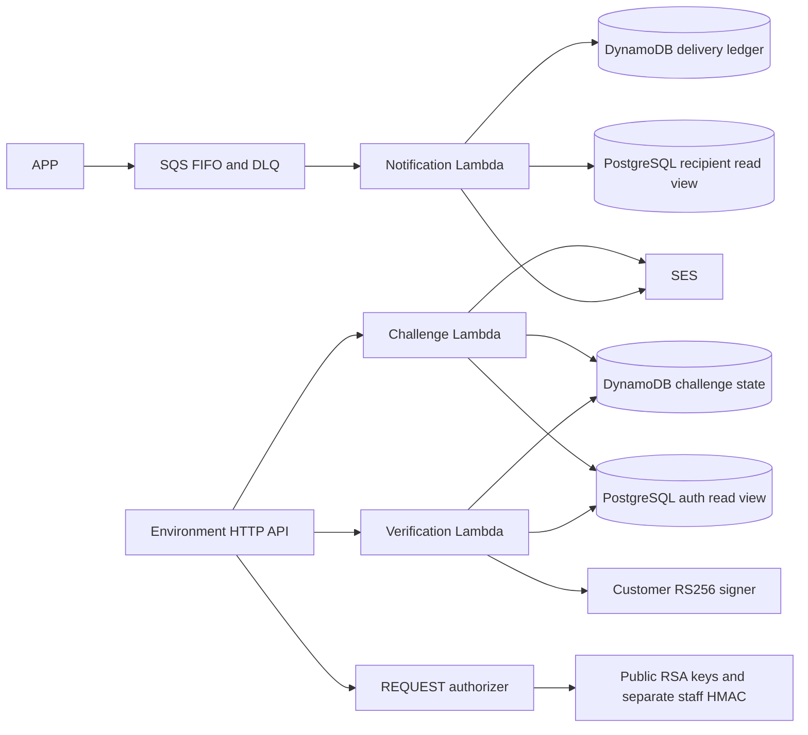
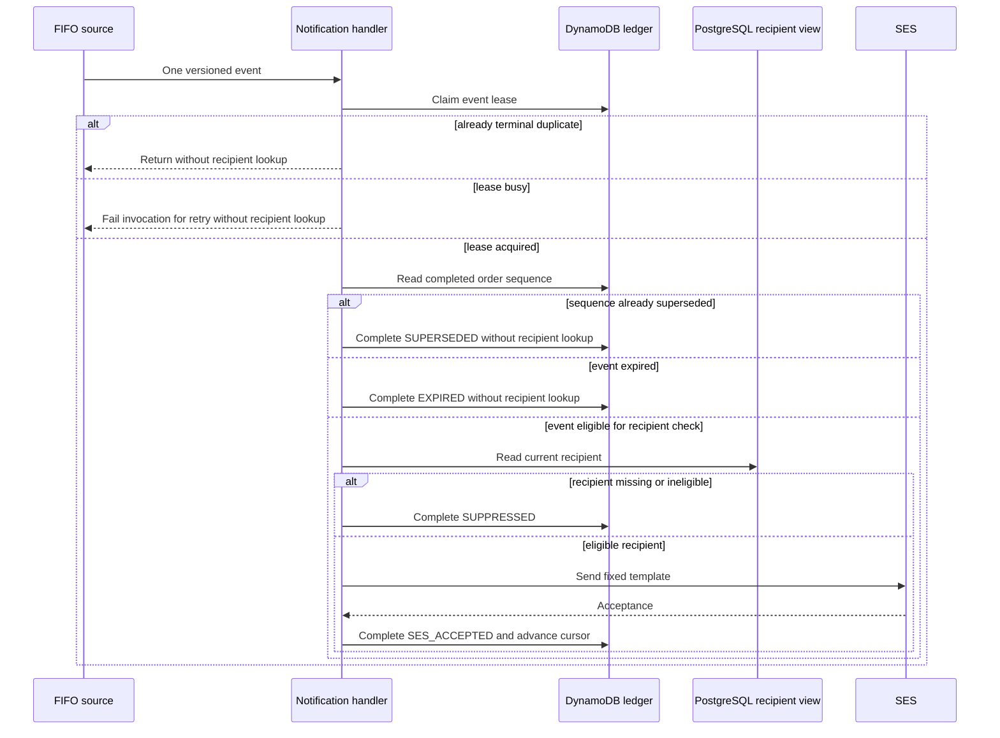

# Functions architecture

FUN owns handler/use-case/adapters and the I5 runtime Terraform source. K8S owns the base API/stage and APP integrations; FUN owns the Lambda REQUEST authorizer and the two public CPF routes using the K8S API handoff. The [reviewed state handoff](runtime-permissions.md) documents the two-phase activation. FUN does not own APP business mutations or PostgreSQL base tables. The API consumer contract is the [APP snapshot](../../Tech-challenge-15SOAT/docs/phase-3/api/contracts.md).

DynamoDB provides conditional OTP consumption and event/cursor coordination without making TTL cleanup a correctness mechanism. PostgreSQL remains the current identity/recipient and business source. A crash after SES acceptance but before ledger completion can duplicate email; neither FIFO nor the ledger establishes exactly-once external delivery. See [challenge model](challenge-state.md), [trust/key rotation](token-trust.md) and [notification failure window](notification-delivery.md).

Technologies: Java 17, Maven, AWS SDK v2, Lambda, DynamoDB, SQS FIFO, SES and Terraform 1.15.8. Prerequisites: JDK 17, Docker for JDBC Testcontainers, PowerShell 7, Terraform and initialized mock-provider dependencies. There is no standalone local HTTP server or Dockerfile; handler tests use fixtures.

From this root run `./mvnw.cmd -B verify` and `pwsh -File tests/verify-infrastructure.ps1`; Linux uses `./mvnw`. [CI](../.github/workflows/ci.yml) checks PRs and pushes to main/develop with no AWS identity. [I7 prerequisites](i7-pipeline-contracts.md) keep cloud adapters disabled. See [source/evidence matrix](evidence/requirements.md), [RFC 003](../../Tech-challenge-15SOAT/docs/rfcs/003-cpf-authentication.md), [RFC 004](../../Tech-challenge-15SOAT/docs/rfcs/004-notifications.md), [ADR 003](../../Tech-challenge-15SOAT/docs/adrs/003-token-trust.md) and [ADR 004](../../Tech-challenge-15SOAT/docs/adrs/004-outbox-delivery.md).
