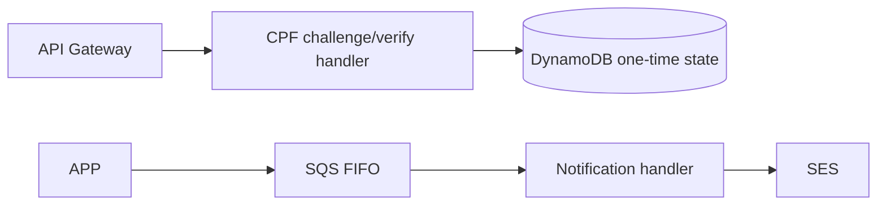

# Functions architecture

CPF requests invoke Java handlers; DynamoDB conditionally stores/consumes one-time challenge state. Notification consumes the environment FIFO queue, records delivery state and sends through SES. K8S owns Lambda, IAM, queue and layer deployment; FUN owns handler code and contracts. The public consumer contract is APP [API snapshot](../../Tech-challenge-15SOAT/docs/phase-3/api/contracts.md).

Technologies: Java 17, Maven, Lambda events, AWS SDK v2, DynamoDB, SQS FIFO, SES and Terraform alarm contracts. Prerequisites: Java 17, Maven wrapper and Terraform 1.15.8. There is no local API or Dockerfile. From the root verify with `./mvnw.cmd -B verify` and `terraform -chdir=infra/modules/functions test`; CI is [`.github/workflows/ci.yml`](../.github/workflows/ci.yml), triggered by push and pull request for `main`, `master`, and `develop`, plus manual dispatch. Deployment is a K8S handoff requiring protected identity and an authorized R4 window; no endpoint is claimed active.
